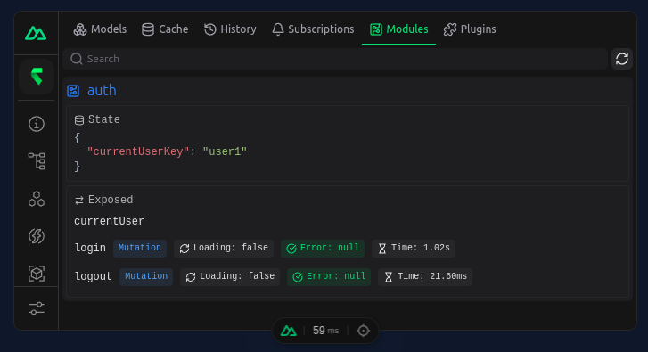

# Module

In most application, there are cases where some specific logic or state is needed. For example, you may want to handle the current user with a specific key and also have special mutations for login or logout.

For this, you can create an rstore module, which is a shared composable that calls `createModule` and returns some exposed properties.

```ts
// src/composables/auth.ts

import { createModule, defineModule } from '@rstore/vue'

export const useAuth = defineModule(() => {
  const store = useStore()

  const { state, resolve, onResolve, defineMutation } = createModule(store, {
    name: 'auth',
    state: {
      // Create some state here
      currentUserKey: null as string | null,
    },
  })

  return resolve({
    // Expose things here
  })
})
```

::: tip
With the `@rstore/nuxt` module, you can directly use the auto-imported `defineRstoreModule` function instead of `defineModule` and `createRstoreModule` instead of `createModule`.
:::

## Benefits of using modules

- **Encapsulation**: Modules allow you to encapsulate related state, queries and mutations, making your code more organized and easier to maintain.
- **Reusability**: You can create reusable modules that can be shared across different parts of your application or even across different applications.
- **Shared**: rstore modules are automatically shared across all components that use them, so they are only created once.
- **SSR**: Modules are automatically SSR compatible, so you don't have to worry about the state being lost during server-side rendering.
- **Async**: You can use async code (see `onResolve` below) to initialize the module.
- **Hybrid promise**: Awaiting a module is optional, all exposed properties are also available directly.
- **Devtools**: You can inspect the module in the rstore devtools (current only available in Nuxt).



## State

Define the state of the module using the `state` option of `createModule`. The state is reactive and stored in the rstore cache (which also means it is transferred to the client in SSR).

```ts{3-5}
const { state } = createModule(store, {
  name: 'auth',
  state: {
    currentUserKey: null as string | null,
  },
})
```

## Expose

You must return the result of the `resolve` function to expose the module properties. The `resolve` function takes an object with the properties you want to expose.

```ts{6-8}
const { state, resolve } = createModule(store, {
  name: 'auth',
  state: {},
})

return resolve({
  // Expose things here
})
```

You can for example expose a query:

```ts
const { state, resolve } = createModule(store, {
  name: 'auth',
  state: {
    currentUserKey: null as string | null,
  },
})

const currentUser = store.User.query(q => q.first(state.currentUserKey
  ? {
      key: state.currentUserKey,
    }
  : {
      enabled: false,
    }))

return resolve({
  currentUser,
})
```

You can now use the `useAuth` composable in your components:

```ts
const auth = useAuth()
const { data: currentUser } = auth.currentUser
```

## onResolve

You can use the `onResolve` function to run some code when the module is resolved. This is useful for initializing the module or running some async code.

```ts
const { state, resolve, onResolve, defineMutation } = createModule(store, {
  name: 'auth',
  state: {
    currentUserKey: null as string | null,
  },
})

const currentUser = store.User.query(q => q.first({ /* ... */ }))

const requestFetch = useRequestFetch()

async function initCurrentUser() {
  try {
    const user = await requestFetch('/api/auth/me')
    if (user) {
      state.currentUserKey = user.id
      store.User.writeItem({
        ...user,
        createdAt: new Date(user.createdAt),
      })
    }
    else {
      state.currentUserKey = null
    }
  }
  catch (e) {
    console.error('Failed to init current user', e)
  }
}

onResolve(async () => {
  await initCurrentUser()
})

return resolve({
  currentUser,
})
```

::: warning
The `store.<model>.writeItem` function does not currently apply parsing as defined in the model configuration. This is a known issue and will be fixed in a future release.
:::

You can then await the module in your component:

```ts
const auth = await useAuth()

// Current user is fetched already

const { data: currentUser } = auth.currentUser
```

::: tip
Awaiting a module is always optional. You can use the module without awaiting it, but all necessary code might not have run yet. This is a valid use case if you don't use async component setup for example.
:::

## Mutations

You can define mutations using the `defineMutation` function. This is useful for defining actions that modify the state of the module or the store in general.

```ts
const { state, resolve, defineMutation } = createModule(store, {
  name: 'auth',
  state: {
    currentUserKey: null as string | null,
  },
})

// ...

const login = defineMutation(async (email: string, password: string) => {
  const result = await $fetch('/api/auth/login', {
    method: 'POST',
    body: {
      email,
      password,
    },
  })
  state.currentUserKey = result.userId
})

const logout = defineMutation(async () => {
  await $fetch('/api/auth/logout', {
    method: 'POST',
  })
  state.currentUserKey = null
})

onResolve(async () => {
  await initCurrentUser()
})

return resolve({
  currentUser,
  login,
  logout,
})
```

Mutation comes with automatic loading and error states, that you can access using the `$loading` and `$error` properties:

::: code-group

```vue{8,11-14} [simple]
<script setup lang="ts">
const auth = useAuth()
const email = ref('')
const password = ref('')
</script>

<template>
  <UForm @submit="auth.login(email, password)">
    <UInput v-model="email" label="Email" />
    <UInput v-model="password" label="Password" type="password" />
    <UButton :loading="auth.login.$loading.value">Login</UButton>
    <UAlert v-if="auth.login.$error.value" color="error">
      {{ auth.login.$error.value.message }}
    </UAlert>
  </UForm>
</template>
```

```vue{3,10,13-16} [destructured]
<script setup lang="ts">
const auth = useAuth()
const { call: login, $loading: loginLoading, $error: loadingError } = auth.login

const email = ref('')
const password = ref('')
</script>

<template>
  <UForm @submit="login(null, email, password)">
    <UInput v-model="email" label="Email" />
    <UInput v-model="password" label="Password" type="password" />
    <UButton :loading="loginLoading">Login</UButton>
    <UAlert v-if="loadingError" color="error">
      {{ loadingError.message }}
    </UAlert>
  </UForm>
</template>
```

:::

The mutations are also tracked in the rstore devtools with their loading and error states, and the duration of the last call.
