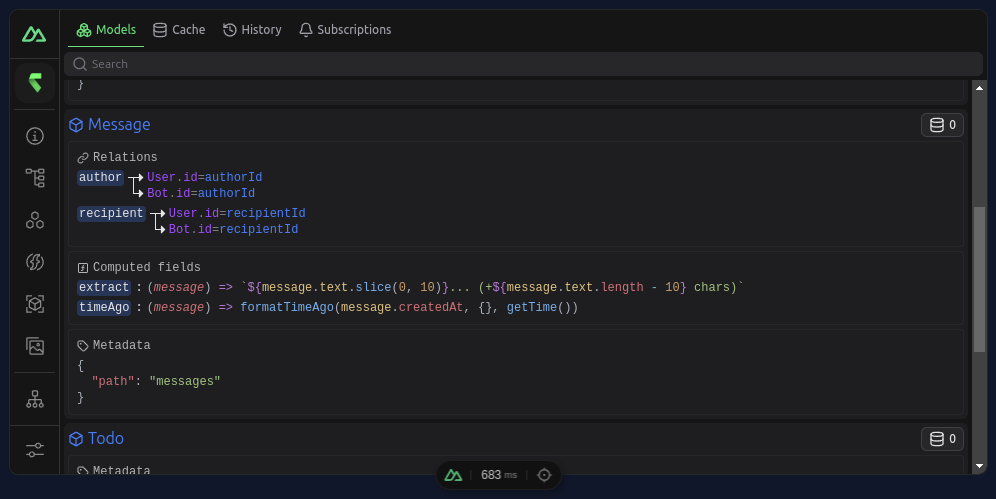
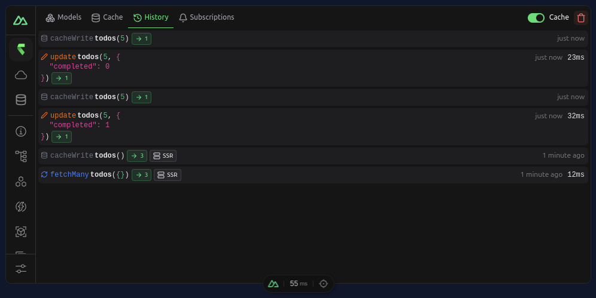

# Getting Started

rstore is a data store allowing you to handle all data in your application.

Define a data collection and then run queries or execute mutations (create, update and delete) on your data.

**FEATURES**

- **Normalized reactive cache** to ensure all components are up-to-date
- **Co-locate queries** within the components that need them
- **Fully adaptable** with plugins to fetch from any source (REST, GraphQL...)
- **Scale down** to small prototypes and **scale up** to big enterprise apps
- Query API designed for **local-first** and **realtime**
- **Form API** to handle form state and validation
- **Subscriptions** for realtime updates
- **Offline support** with automatic synchronization
- **TypeScript support** with full autocomplete
- **Nuxt module** with devtools

[Learn more](./learn-more.md)

## Vue

1. Install rstore:

::: code-group

```sh [npm]
npm i @rstore/vue
```

```sh [pnpm]
pnpm i @rstore/vue
```

:::

2. Create some Collections:

::: code-group

```js [src/rstore/collection.js]
import { defineCollection } from '@rstore/vue'

export const todoCollection = defineCollection({
  name: 'todos',
  // Interact with a REST/GraphQL/etc. API
  hooks: {
    fetchFirst: ({ key }) => fetch(`/api/todos/${key}`).then(r => r.json()),
    fetchMany: ({ params }) => fetch('/api/todos').then(r => r.json()),
    create: ({ item }) => { /* ... */ },
    update: ({ key, item }) => { /* ... */ },
    delete: ({ key }) => { /* ... */ },
  },
})
```

```ts [src/rstore/collection.ts]
import type { StoreSchema } from '@rstore/vue'
import { withItemType } from '@rstore/vue'

// Item type
export interface Todo {
  id: string
  text: string
  completed: boolean
  createdAt: Date
  updatedAt?: Date
}

// Collection
const todoCollection = withItemType<Todo>().defineCollection({
  name: 'todos',
})

export const schema = [
  todoCollection,
] satisfies StoreSchema
```

:::

::: info
Instead of defining the hooks in the collection, you can also create a plugin to handle the fetching logic for many collections at once (see [Plugins](./plugin/setup.md)).
:::

<!--

3. Create a plugin to interact with an API:

::: code-group

```js [src/rstore/plugin.js]
import { definePlugin } from '@rstore/vue'

export default definePlugin({
  name: 'my-rstore-plugin',

  setup({ hook }) {
    // Register rstore hooks here
  },
})
```

:::

::: warning IMPORTANT
By default, rstore doesn't make any assumption about the way you fetch data in your app. Plugins can hook into it to provide fetching logic (for example to make requests to a REST API).
:::

Example for a simple REST API:

```js [src/rstore/plugin.js]
export default definePlugin({
  name: 'my-rstore-plugin',

  setup({ hook }) {
    hook('fetchFirst', async (payload) => {
      if (payload.key) {
        const result = await fetch(`/api/${payload.collection.name}/${payload.key}`)
          .then(r => r.json())
        payload.setResult(result)
      }
    })

    hook('fetchMany', async (payload) => {
      const result = await fetch(`/api/${payload.collection.name}`)
        .then(r => r.json())
      payload.setResult(result)
    })

    hook('createItem', async (payload) => {
      const result = await fetch(`/api/${payload.collection.name}`, {
        method: 'POST',
        headers: {
          'Content-Type': 'application/json',
        },
        body: JSON.stringify(payload.item),
      }).then(r => r.json())
      payload.setResult(result)
    })

    hook('updateItem', async (payload) => {
      const result = await fetch(`/api/${payload.collection.name}/${payload.key}`, {
        method: 'PATCH',
        headers: {
          'Content-Type': 'application/json',
        },
        body: JSON.stringify(payload.item),
      }).then(r => r.json())
      payload.setResult(result)
    })

    hook('deleteItem', async (payload) => {
      await fetch(`/api/${payload.collection.name}/${payload.key}`, {
        method: 'DELETE',
      })
    })
  },
})
```

::: info
In the future rstore will provide some builtin plugins for GraphQL, OpenAPI and other popular standards. Feel free to also share your own plugins with the community! 😸
:::

-->

3. Create the store:

::: code-group

```js [src/rstore/index.js]
import { createStore } from '@rstore/vue'
import { todoCollection } from './collection'
import myPlugin from './plugin'

export async function setupRstore(app) {
  const store = await createStore({
    schema: [
      todoCollection,
    ],
    plugins: [
      myPlugin,
    ],
  })
}
```

```ts [src/rstore/index.ts]
import type { App } from 'vue'
import { createStore } from '@rstore/vue'
import { schema } from './collection'
import myPlugin from './plugin'

export async function setupRstore(app: App) {
  const store = await createStore({
    schema,
    plugins: [
      myPlugin,
    ],
  })
}
```

:::

4. Install the store into the app:

::: code-group

```js{1,8,11-17} [src/rstore/index.js]
import { RstorePlugin } from '@rstore/vue'

export async function setupRstore(app) {
  const store = await createStore({
    // ...
  })

  app.use(RstorePlugin, { store })
}
```

```ts{1,2,4,11,14-20} [src/rstore/index.ts]
import { RstorePlugin, type VueStore } from '@rstore/vue'

export async function setupRstore(app: App) {
  const store = await createStore({
    // ...
  })

  app.use(RstorePlugin, { store })
}

// Augment the `useStore` type
declare module '@rstore/vue' {
  export function useStore(): VueStore<typeof schema>
}
```

:::

5. Add the store to your app:

```js
import { setupRstore } from './rstore'

app.use(setupRstore)
```

6. Use the store in a component:

```vue
<script setup>
import { useStore } from '@rstore/vue'

const store = useStore()

const { data: todos } = store.todos.query(q => q.many())
</script>

<template>
  <pre>{{ todos }}</pre>
</template>
```

## Nuxt

The Nuxt module will automatically:
- scan the `app/rstore` folder in your Nuxt app for collections,
- scan the `app/rstore/plugins` folder and register plugins (using `export default`),
- create the store
- handle SSR payload
- expose the `useStore` composable typed according to the collection (from the `rstore` folder).

<br>

1. Install rstore and add it to the Nuxt config:

::: code-group

```sh [npm]
npm i @rstore/nuxt
```

```sh [pnpm]
pnpm i @rstore/nuxt
```

```ts{3} [nuxt.config.ts]
export default defineNuxtConfig({
  modules: [
    '@rstore/nuxt',
  ],
})
```

:::

2. Create some Collections in the `app/rstore` folder of your Nuxt app:

::: code-group

```ts [app/rstore/todo.ts]
// One Collection
export default RStoreSchema.withItemType<Todo>().defineCollection({
  name: 'todos',
  // Interact with a REST/GraphQL/etc. API
  hooks: {
    fetchFirst: ({ key }) => $fetch(`/api/todos/${key}`),
    fetchMany: ({ params }) => $fetch('/api/todos', { query: params }),
    create: ({ item }) => { /* ... */ },
    update: ({ key, item }) => { /* ... */ },
    delete: ({ key }) => { /* ... */ },
  },
})
```

```ts [app/rstore/multiple.ts]
// Multiple Collections
export const users = RStoreSchema.withItemType<User>().defineCollection({
  name: 'users',
  // Interact with a REST/GraphQL/etc. API
  hooks: {
    fetchFirst: ({ key }) => $fetch(`/api/users/${key}`),
    fetchMany: ({ params }) => $fetch('/api/users', { query: params }),
    create: ({ item }) => { /* ... */ },
    update: ({ key, item }) => { /* ... */ },
    delete: ({ key }) => { /* ... */ },
  },
})

export const bots = RStoreSchema.withItemType<Bot>().defineCollection({
  name: 'bots',
  // Interact with a REST/GraphQL/etc. API
  hooks: {
    fetchFirst: ({ key }) => $fetch(`/api/bots/${key}`),
    fetchMany: ({ params }) => $fetch('/api/bots', { query: params }),
    create: ({ item }) => { /* ... */ },
    update: ({ key, item }) => { /* ... */ },
    delete: ({ key }) => { /* ... */ },
  },
})
```

```ts [shared/types/collection.ts]
// Item types

export interface Todo {
  id: string
  text: string
  completed: boolean
  createdAt: Date
  updatedAt?: Date
}

export interface User {
  id: string
  name: string
  email: string
}

export interface Bot {
  id: string
  name: string
}
```

:::

::: warning FILE SCANNING
The rstore module will only scan exports in files in the `rstore` folder and not in nested folders. If you want to split the collections in multiple folders, you need to re-export each variables or use Nuxt layers (recommended).
:::

::: info
Instead of defining the hooks in the collection, you can also create a plugin to handle the fetching logic for many collections at once (see [Plugins](./plugin/setup.md)).
:::

::: tip Nuxt Layers
You can also add an `app/rstore` folder in Nuxt layers! rstore will automatically add those files too.
:::

<!--

3. Create a plugin to interact with an API in the `rstore/plugins` folder:

::: code-group

```ts [app/rstore/plugins/my-plugin.ts]
export default defineRstorePlugin({
  name: 'my-rstore-plugin',

  setup({ hook }) {
    // Register rstore hooks here
  },
})
```

:::

::: warning IMPORTANT
By default, rstore doesn't make any assumption about the way you fetch data in your app. Plugins can hook into it to provide fetching logic (for example to make requests to a REST API).
:::

Example for a simple REST API:

```js [src/rstore/plugin.ts]
export default defineRstorePlugin({
  name: 'my-rstore-plugin',

  setup({ hook }) {
    hook('fetchFirst', async (payload) => {
      if (payload.key) {
        const result = await $fetch(`/api/${payload.collection.name}/${payload.key}`)
        payload.setResult(result)
      }
    })

    hook('fetchMany', async (payload) => {
      const result = await $fetch(`/api/${payload.collection.name}`)
      payload.setResult(result)
    })

    hook('createItem', async (payload) => {
      const result = await $fetch(`/api/${payload.collection.name}`, {
        method: 'POST',
        body: payload.item,
      })
      payload.setResult(result)
    })

    hook('updateItem', async (payload) => {
      const result = await $fetch(`/api/${payload.collection.name}/${payload.key}`, {
        method: 'PATCH',
        body: payload.item,
      })
      payload.setResult(result)
    })

    hook('deleteItem', async (payload) => {
      await $fetch(`/api/${payload.collection.name}/${payload.key}`, {
        method: 'DELETE',
      })
    })
  },
})
```

::: info
In the future rstore will provide some builtin plugins for GraphQL, OpenAPI and other popular standards. Feel free to also share your own plugins with the community! 😸
:::

-->

3. Use the store in a component:

```vue
<script setup>
const store = useStore()

const { data: todos } = await store.todos.query(q => q.many())
</script>

<template>
  <pre>{{ todos }}</pre>
</template>
```

Open the Nuxt devtools and check the `rstore` tab:





## Nuxt + Drizzle

[Online Demo](https://codesandbox.io/p/devbox/wonderful-sun-s4cgl6)

In case you are using [Drizzle](https://orm.drizzle.team), you can install the `@rstore/nuxt-drizzle` module instead of `@rstore/nuxt` to automatically generate the collections and plugins from your drizzle schema.

1. Install `@rstore/nuxt-drizzle` and add it to the Nuxt config:

```sh
npm i @rstore/nuxt-drizzle
```

```ts [nuxt.config.ts]
export default defineNuxtConfig({
  modules: [
    '@rstore/nuxt-drizzle',
  ],
})
```

2. Expose a function to return a drizzle instance:

```ts
// server/utils/drizzle.ts

import { drizzle } from 'drizzle-orm/libsql'

let drizzleInstance: ReturnType<typeof drizzle> | null = null

export function useDrizzle() {
  drizzleInstance ??= drizzle({
    connection: { url: useRuntimeConfig().dbUrl },
    casing: 'snake_case',
  })
  return drizzleInstance
}
```

The module will automatically:
- load the drizzle schema from the `drizzle.config.ts` file (configurable with the `rstoreDrizzle.drizzleConfigPath` option in the Nuxt config),
- generate the collections from the schema for each table with the relations,
- generate a REST API under the `/api/rstore` path to handle the CRUD operations,
- generate a plugin to handle the queries and mutations,
- generate all the necessary types for the collections and the API.

You can already use the store in your components without any additional configuration:

```vue
<script setup>
const store = useStore()

const { data: todos } = await store.todos.query(q => q.many())
</script>

<template>
  <pre>{{ todos }}</pre>
</template>
```

[Continue to the plugin documentation ➜](../plugins/nuxt-drizzle.md)

## Nuxt + Directus

You can use the `@rstore/nuxt-directus` module to automatically generate the collections and plugins from your [Directus](https://directus.io) backend.

```bash
npm install @rstore/nuxt-directus
```

```ts
export default defineNuxtConfig({
  modules: [
    '@rstore/nuxt-directus',
  ],

  rstoreDirectus: {
    url: 'https://your-directus-instance.com', // The URL of your Directus instance
    adminToken: import.meta.env.DIRECTUS_TOKEN, // The admin token you created in step 2
  },
})
```

[Continue to the plugin documentation ➜](../plugins/nuxt-directus.md)
