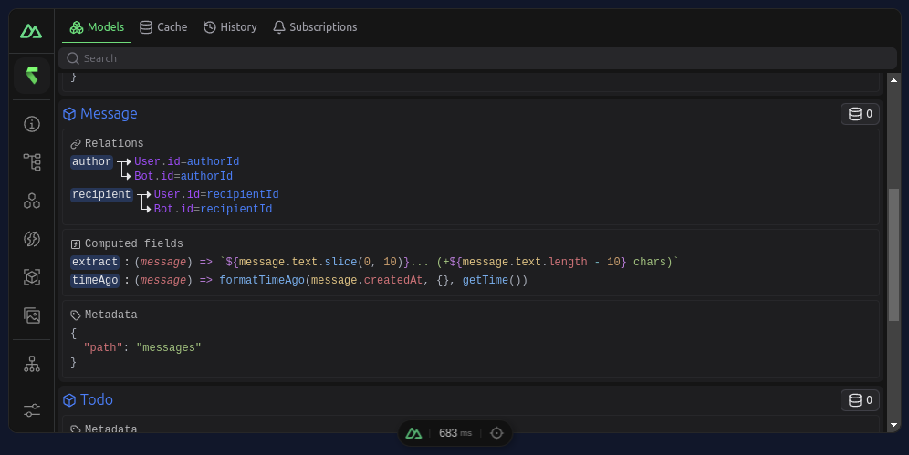
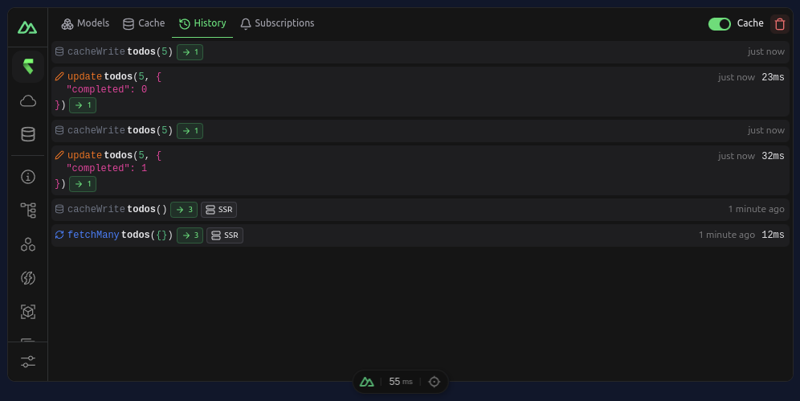

# Getting Started

rstore is a local-first data store for Vue and Nuxt applications. The core workflow is simple:

1. Define collections for your app data.
2. Connect those collections to your backend with hooks or plugins.
3. Query and mutate data from components.

## Choose your setup

- Use [`@rstore/vue`](#vue) for a standard Vue app where you create the store yourself.
- Use [`@rstore/nuxt`](#nuxt) for Nuxt auto-registration, typed `useStore()`, SSR integration, and DevTools support.
- Use [`@rstore/nuxt-drizzle`](#nuxt-drizzle) if you already have a Drizzle schema and want rstore generated from it.

## Before you start

- You need at least one data source strategy: collection-level hooks or plugins (REST, GraphQL, local DB, etc.).
- `query` / `liveQuery` are designed for Vue `setup()` (they are reactive and also awaitable).
- If you use TypeScript with Vue (non-Nuxt), keep your schema in one module so `useStore()` augmentation stays easy to maintain.
- For collaborative realtime editing, use the [`@rstore/yjs` plugin](../plugins/yjs.md).

## Vue

Use `@rstore/vue` when you want explicit control over store creation and plugin registration.

### 1. Install

::: code-group

```sh [npm]
npm i @rstore/vue
```

```sh [pnpm]
pnpm i @rstore/vue
```

:::

### 2. Define a collection

This example keeps everything self-contained by putting the backend integration directly in the collection hooks.

```ts [src/rstore/schema.ts]
import type { StoreSchema } from '@rstore/vue'
import { withItemType } from '@rstore/vue'

export interface Todo {
  id: string
  title: string
  completed: boolean
}

const todos = withItemType<Todo>().defineCollection({
  name: 'todos',
  hooks: {
    fetchFirst: ({ key }) => fetch(`/api/todos/${key}`).then(r => r.json()),
    fetchMany: () => fetch('/api/todos').then(r => r.json()),
    create: ({ item }) => fetch('/api/todos', {
      method: 'POST',
      headers: { 'Content-Type': 'application/json' },
      body: JSON.stringify(item),
    }).then(r => r.json()),
    update: ({ key, item }) => fetch(`/api/todos/${key}`, {
      method: 'PATCH',
      headers: { 'Content-Type': 'application/json' },
      body: JSON.stringify(item),
    }).then(r => r.json()),
    delete: ({ key }) => fetch(`/api/todos/${key}`, {
      method: 'DELETE',
    }),
  },
})

export const schema = [
  todos,
] satisfies StoreSchema
```

::: tip
If several collections share the same transport logic, move that logic into a [plugin](./plugin/setup.md) instead of repeating hooks per collection.
:::

### 3. Create and install the store

```ts [src/rstore/index.ts]
import type { VueStore } from '@rstore/vue'
import type { App } from 'vue'
import { createStore, RstorePlugin } from '@rstore/vue'
import { schema } from './schema'

export async function setupRstore(app: App) {
  const store = await createStore({
    schema,
  })

  app.use(RstorePlugin, { store })
}

declare module '@rstore/vue' {
  export function useStore(): VueStore<typeof schema>
}
```

```ts [src/main.ts]
import { createApp } from 'vue'
import App from './App.vue'
import { setupRstore } from './rstore'

async function main() {
  const app = createApp(App)
  await setupRstore(app)
  app.mount('#app')
}

main()
```

### 4. Query and mutate in a component

```vue
<script setup lang="ts">
import { useStore } from '@rstore/vue'

const store = useStore()

const { data: todos, loading } = await store.todos.query(q => q.many())

async function addTodo() {
  await store.todos.create({
    id: crypto.randomUUID(),
    title: 'Ship the docs',
    completed: false,
  })
}
</script>

<template>
  <button @click="addTodo()">
    Add todo
  </button>

  <div v-if="loading">
    Loading...
  </div>

  <ul v-else>
    <li v-for="todo in todos" :key="todo.id">
      {{ todo.title }}
    </li>
  </ul>
</template>
```

Successful mutations update the normalized cache, so all reactive readers stay in sync automatically.

### 5. Next steps

- Learn the collection model in [Schema > Collection](./schema/collection.md)
- Move repeated backend logic into [Plugins](./plugin/setup.md)
- Use [Queries](./data/query.md), [Mutations](./data/mutation.md), and [Forms](./data/form.md)
- Add realtime collaboration with [Yjs plugin](../plugins/yjs.md)

## Nuxt

Use `@rstore/nuxt` when you want Nuxt-native setup with filesystem conventions.

The Nuxt module will automatically:

- scan `app/rstore` for collection exports
- scan `app/rstore/plugins` for plugin exports
- create the store
- handle SSR payload integration
- expose a typed `useStore()` composable
- auto-import schema helpers such as `RStoreSchema` and `defineRstorePlugin`

### 1. Install the module

::: code-group

```sh [npm]
npm i @rstore/nuxt
```

```sh [pnpm]
pnpm i @rstore/nuxt
```

:::

```ts [nuxt.config.ts]
export default defineNuxtConfig({
  modules: ['@rstore/nuxt'],
})
```

### 2. Add collections in `app/rstore`

```ts [app/rstore/todos.ts]
interface Todo {
  id: string
  title: string
  completed: boolean
}

export default RStoreSchema.withItemType<Todo>().defineCollection({
  name: 'todos',
  hooks: {
    fetchFirst: ({ key }) => $fetch(`/api/todos/${key}`),
    fetchMany: () => $fetch('/api/todos'),
    create: ({ item }) => $fetch('/api/todos', {
      method: 'POST',
      body: item,
    }),
    update: ({ key, item }) => $fetch(`/api/todos/${key}`, {
      method: 'PATCH',
      body: item,
    }),
    delete: ({ key }) => $fetch(`/api/todos/${key}`, {
      method: 'DELETE',
    }),
  },
})
```

::: info
If you prefer centralizing transport logic, add plugins in `app/rstore/plugins` and keep collections focused on data shape.
:::

::: warning File scanning
The Nuxt module scans files directly inside `app/rstore`. If you split collections into nested folders, re-export them from a top-level file or use Nuxt layers.
:::

### 3. Use the store in pages and components

```vue
<script setup lang="ts">
const store = useStore()

const { data: todos } = await store.todos.query(q => q.many())

async function toggle(todo) {
  await todo.$update({
    completed: !todo.completed,
  })
}
</script>

<template>
  <ul>
    <li v-for="todo in todos" :key="todo.id">
      <button @click="toggle(todo)">
        {{ todo.completed ? 'Undo' : 'Complete' }}
      </button>
      {{ todo.title }}
    </li>
  </ul>
</template>
```

Open Nuxt DevTools and inspect the `rstore` tab to see collections, cache state, and history:





### 4. Next steps

- Embed the Devtools UI in your app with [Devtools](./devtools.md)
- Learn Nuxt-specific helpers in [Plugins](./plugin/setup.md)
- Explore [live subscriptions](./data/live.md) and [offline support](./data/offline.md)
- Add collaborative editing with [Yjs plugin](../plugins/yjs.md)
- Read about [federation](./schema/federation.md) if you have multiple data sources

## Nuxt + Drizzle

If you already use [Drizzle](https://orm.drizzle.team/), `@rstore/nuxt-drizzle` is the fastest path. It generates rstore collections and the matching server API from your Drizzle schema.

::: info
This setup expects a working Drizzle schema and `drizzle.config.ts` first. If Drizzle is not set up yet, do that before enabling the module.
:::

### 1. Install the module

::: code-group

```sh [npm]
npm i @rstore/nuxt-drizzle
```

```sh [pnpm]
pnpm i @rstore/nuxt-drizzle
```

:::

```ts [nuxt.config.ts]
export default defineNuxtConfig({
  modules: ['@rstore/nuxt-drizzle'],
})
```

### 2. Expose your Drizzle instance

```ts [server/utils/drizzle.ts]
import { drizzle } from 'drizzle-orm/libsql'
import * as schema from '../database/schema'

let drizzleInstance: ReturnType<typeof drizzle> | null = null

export function useDrizzle() {
  drizzleInstance ??= drizzle({
    schema,
    connection: { url: useRuntimeConfig().dbUrl },
  })

  return drizzleInstance
}
```

### 3. Start querying

Once the module is configured, you can query generated collections directly in your app:

```vue
<script setup lang="ts">
const store = useStore()
const { data: posts } = await store.posts.query(q => q.many())
</script>
```

The module automatically wires:

- generated collections from your Drizzle schema
- a server API under `/api/rstore`
- a client plugin for queries and mutations
- type generation for store usage

[Read the full Nuxt + Drizzle guide](../plugins/nuxt-drizzle.md)
