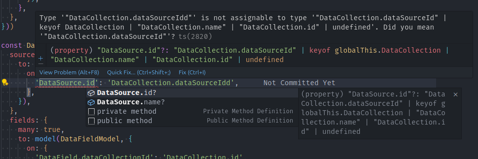

<script setup>
import FrameworkBadges from './components/FrameworkBadges.vue'
</script>

# 0.6 to 0.7 Migration Guide

This guide will help you migrate your code from rstore v0.6 to v0.7. There are a lot of breaking changes, so please read the entire guide carefully and test your code thoroughly after the migration. 

Those changes are necessary to prepare the library for the 1.0 release. :bowing_man:

## Model renamed to Collection

<FrameworkBadges
  :frameworks="{
    vue: true,
    nuxt: true,
  }"
/>

The term `model` has been replaced with `collection` throughout the rstore codebase and API to better reflect its purpose and avoid confusion with Vue's own `defineModel` function and `v-model` API.

```ts
// Schema
defineDataModel({ name: 'todos' }) // [!code --]
defineCollection({ name: 'todos' }) // [!code ++]

defineItemType<Todo>().model({ name: 'todos' }) // [!code --]
withItemType<Todo>().defineCollection({ name: 'todos' }) // [!code ++]

// Advanced APIs
store.$models.find(m => m.name === 'Users') // [!code --]
store.$collections.find(c => c.name === 'Users') // [!code ++]

store.$model('Users').peekFirst('some-id') // [!code --]
store.$collection('Users').peekFirst('some-id') // [!code ++]

store.$getModel({ __typename: 'Users ', id: 'some-id'}) // [!code --]
store.$getCollection({ __typename: 'Users ', id: 'some-id'}) // [!code ++]

// Plugins
hook('fetchFirst', async ({ model, key, params }) => { // [!code --]
hook('fetchFirst', async ({ collection, key, params }) => { // [!code ++]
  // ...
})
```

::: tip
The main APIs such as `store.Users.peekFirst()` are not impacted because the collection name is used directly.
:::

## Store setup

### `defineDataModel` renamed to `defineCollection`

<FrameworkBadges
  :frameworks="{
    vue: true,
    nuxt: true,
  }"
/>

::: info Why this change?
The term `model` has been replaced with `collection` throughout the rstore codebase and API to better reflect its purpose and avoid confusion with Vue's own `defineModel` function and `v-model` API.
:::

```js
import { defineDataModel } from '@rstore/vue' // [!code --]
import { defineCollection } from '@rstore/vue' // [!code ++]

const todoCollection = defineDataModel({ // [!code --]
const todoCollection = defineCollection({ // [!code ++]
  name: 'todos',
})
```

### `defineItemType` renamed to `withItemType`

<FrameworkBadges
  :frameworks="{
    vue: true,
    nuxt: true,
  }"
/>

::: info Why this change?
The `defineItemType` function has been renamed to `withItemType` (and its method from `model` to `defineCollection`) to better reflect its purpose of defining the collection with the `defineCollection` method that is chained to it.
:::

```ts
import { defineItemType } from '@rstore/vue' // [!code --]
import { withItemType } from '@rstore/vue' // [!code ++]

interface Todo {
  id: string
  title: string
  completed: boolean
}

const todoCollection = defineItemType<Todo>().model({ // [!code --]
const todoCollection = withItemType<Todo>().defineCollection({ // [!code ++]
  name: 'todos',
})
```

### Use `RStoreSchema` in Nuxt

<FrameworkBadges
  :frameworks="{
    vue: false,
    nuxt: true,
  }"
/>

You need to use the `RStoreSchema` auto-imported namespace to define collections and relations.

::: info Why this change?
This change was made to avoid potential naming conflicts with other libraries or your own code. It also makes it clearer that those functions are part of the rstore library to define your store schema.
:::

```ts
const Users = defineItemType<User>().model({ // [!code --]
const Users = RStoreSchema.withItemType<User>().defineCollection({ // [!code ++]
  name: 'users',
})
```

### `models` renamed to `schema`

<FrameworkBadges
  :frameworks="{
    vue: true,
    nuxt: false,
  }"
/>

::: info Why this change?
Since it now contains both collections (previously models) and relations ([see below](#relation-definitions-shape-changed)) - and maybe other objects in the future, the `models` option has been renamed to `schema`.
:::

```ts
const store = await createStore({
  models: [ // [!code --]
  schema: [ // [!code ++]
    { name: 'todos' },
    { name: 'users' },
  ],
  plugins: [],
})
```

### Use the RstorePlugin

<FrameworkBadges
  :frameworks="{
    vue: true,
    nuxt: false,
  }"
/>

You should now use the `RstorePlugin` from `@rstore/vue` to install the store in your Vue app. This will automatically provide the store to all components and make it available via the new `useStore` function from `@rstore/vue`.

::: info Why this change?
This change simplifies the store setup and makes it easier to use the store in your components. It also makes it possible to use the new `useStore` function from `@rstore/vue` directly without having to create your own.
:::

```ts
import type { VueStore } from '@rstore/vue'
import type { InjectionKey } from 'vue' // [!code --]
import { RstorePlugin } from '@rstore/vue' // [!code ++]

const injectStoreKey = Symbol('rstore') as InjectionKey<VueStore<typeof schema>> // [!code --]

export async function rstore(app: App) {
  const store = await createStore({
    // ...
  })

  app.provide(injectStoreKey, store) // [!code --]
  app.use(RstorePlugin, { store })  // [!code ++]
}

export function useStore () { // [!code --]
  const store = inject(injectStoreKey, null) // [!code --]
  if (store == null) { // [!code --]
    throw new Error('No rstore provided.') // [!code --]
  } // [!code --]
  return store // [!code --]
} // [!code --]

// Augment the `useStore` type
declare module '@rstore/vue' { // [!code ++]
  export function useStore(): VueStore<typeof schema> // [!code ++]
} // [!code ++]
```

### useStore()

<FrameworkBadges
  :frameworks="{
    vue: true,
    nuxt: false,
  }"
/>

You can now use the new `useStore` function from `@rstore/vue` directly instead of creating your own.

::: info Why this change?
This change simplifies the store usage in your components and makes it easier to get the store instance without having to create your own `useStore` function.
:::

```ts
import { useStore } from 'your-own-path/rstore' // [!code --]
import { useStore } from '@rstore/vue' // [!code ++]
```

### Relation definitions shape changed

<FrameworkBadges
  :frameworks="{
    vue: true,
    nuxt: true,
  }"
/>

Instead of defining the related fields using `on` and `eq` that were confusing, you now define the related fields using an `on` object that maps the foreign fields to the local fields with the name of the collections to make it clearer.

::: info Why this change?
This new syntax is more explicit and easier to understand. It also allows for more complex relations such as mapping multiple fields or using a custom filter function.
:::

```ts
import { defineItemType } from '@rstore/vue'

interface User {
  id: string
  name: string
}

const userCollection = defineItemType<User>().defineCollection({
  name: 'users',
  relations: {
    receivedMessages: {
      to: {
        messages: {
          on: 'recipientId', // [!code --] Message.recipientId
          eq: 'id', // [!code --] User.id
          on: { // [!code ++]
            'messages.recipientId': 'users.id', // [!code ++]
          }, // [!code ++]
        },
      },
      many: true,
    },
    sentMessages: {
      to: {
        messages: {
          on: 'senderId', // [!code --] Message.senderId
          eq: 'id', // [!code --] User.id
          on: { // [!code ++]
            'messages.senderId': 'users.id', // [!code ++]
          }, // [!code ++]
        },
      },
      many: true,
    },
  },
})

interface Message {
  id: string
  content: string
  senderId: string
  recipientId: string
}

const messageCollection = defineItemType<Message>().defineCollection({
  name: 'messages',
  relations: {
    sender: {
      to: {
        users: {
          on: 'senderId', // [!code --] Message.senderId
          eq: 'id', // [!code --] User.id
          on: { // [!code ++]
            'users.id': 'messages.senderId', // [!code ++]
          }, // [!code ++]
        },
      },
    },
    recipient: {
      to: {
        users: {
          on: 'recipientId', // [!code --] Message.recipientId
          eq: 'id', // [!code --] User.id
          on: { // [!code ++]
            'users.id': 'messages.recipientId', // [!code ++]
          }, // [!code ++]
        },
      },
    },
  },
})
```

This new syntax also allows you to map multiple fields on a single relation:

```ts
const myCollection = {
  name: 'things',
  relations: {
    relatedItems: {
      to: {
        otherCollection: {
          on: {
            'otherCollection.type': 'things.relatedItemType', // [!code ++]
            'otherCollection.subType': 'things.relatedItemSubType', // [!code ++]
          },
        },
      },
    },
  },
}
```

Or specify a custom filter function:

```ts
const myCollection = {
  name: 'things',
  relations: {
    relatedItems: {
      to: {
        otherCollection: {
          on: {
            // 'otherCollection.type': 'things.relatedItemType',
          },
          filter: (item, relationItem) => // [!code ++]
            item.relatedStatusList.includes(relationItem.status), // [!code ++]
        },
      },
    },
  },
}
```

If you use TypeScript, it is now recommended to use the new `defineRelations` helper to define your relations with proper typing:

```ts
import type { StoreSchema } from '@rstore/vue'
import { defineItemType, defineRelations } from '@rstore/vue'

interface User {
  id: string
  name: string
}

const userCollection = defineItemType<User>().defineCollection({
  name: 'users',
})

interface Message {
  id: string
  content: string
  senderId: string
  recipientId: string
}

const messageCollection = defineItemType<Message>().defineCollection({
  name: 'messages',
})

const userRelations = defineRelations(userCollection, ({ collection }) => ({
  receivedMessages: {
    to: collection(messageCollection, {
      on: {
        'messages.recipientId': 'users.id', // Type checked!
      },
    }),
    many: true,
  },
  sentMessages: {
    to: collection(messageCollection, {
      on: {
        'messages.senderId': 'users.id', // Type checked!
      },
    }),
    many: true,
  },
}))

const messageRelations = defineRelations(messageCollection, ({ collection }) => ({
  sender: {
    to: collection(userCollection, {
      on: {
        'users.id': 'messages.senderId', // Type checked!
      },
    }),
  },
  recipient: {
    to: collection(userCollection, {
      on: {
        'users.id': 'messages.recipientId', // Type checked!
      },
    }),
  },
}))

export const schema = [
  userCollection,
  messageCollection,
  userRelations,
  messageRelations,
] as const satisfies StoreSchema
```

Example of the typechecking in action:



## Query

### Methods don't accept Ref or getter anymore

<FrameworkBadges
  :frameworks="{
    vue: true,
    nuxt: true,
  }"
/>

The following methods no longer accept a Ref or a getter function as argument. You must now always pass a plain object (or string/number for single key):

- `peekFirst`
- `peekMany`
- `findFirst`
- `findMany`

```ts
store.User.peekFirst(() => 'toto') // [!code --]
store.User.peekFirst('toto') // [!code ++]

store.User.peekFirst(userIdRef) // [!code --]
store.User.peekFirst(userIdRef.value) // [!code ++]
```

::: info Why this change?
This change was made to simplify the API and avoid confusion. Those methods are not reactive and will not update automatically when the Ref or the result of the getter function changes. If you want to use a Ref or a getter function, you can use the `query` or `liveQuery` methods instead.
:::

### New Query API

<FrameworkBadges
  :frameworks="{
    vue: true,
    nuxt: true,
  }"
/>

The following methods have been removed:

- `queryFirst`
- `queryMany`
- `liveQueryFirst`
- `liveQueryMany`

They have been replaced by the following methods:

- `query`
- `liveQuery`

Those two new methods accept a function that receives a query builder as argument. You can then use the `first` or `many` methods of the query builder to build your query.

::: info Why this change?
This new syntax allows TypeScript to fully type check the entire options object, including verifying for excess properties in deeply nested objects. The old syntax was not type checked properly and your code could easily contain typos or mistakes that would not be caught by the compiler. This is due to a limitation in TypeScript (see [microsoft/TypeScript#241](https://github.com/microsoft/TypeScript/issues/241)).
:::

```ts
const { data: user } = await store.User.queryFirst('toto') // [!code --]
const { data: user } = await store.User.query(q => q.first('toto')) // [!code ++]
```

```ts
const { data: user } = await store.User.queryFirst(() => ({ // [!code --]
const { data: user } = await store.User.query(q => q.first({ // [!code ++]
  key: userId.value,
  include: { receivedMessages: true },
}))
```

```ts
const { data: messages } = await store.Message.queryMany(() => ({ // [!code --]
const { data: messages } = await store.Message.query(q => q.many({ // [!code ++]
  filter: m => m.recipientId === userId.value,
}))
```

```ts
const { data: messages } = await store.Message.liveQueryMany(() => ({ // [!code --]
const { data: messages } = await store.Message.liveQuery(q => q.many({ // [!code ++]
  filter: m => m.recipientId === userId.value,
}))
```

::: warning
Since the type checking is now stricter, you might encounter new type errors in your code that you didn't have before. This means that your code was not fully correct and you should fix the errors. If somethig looks wrong, please [open an issue](https://github.com/directus/rstore/issues/new?template=bug-report.yml). :pray:
:::

### Subscribe method now accepts query builder

<FrameworkBadges
  :frameworks="{
    vue: true,
    nuxt: true,
  }"
/>

The `subscribe` method now only accepts a function that receives a query builder as argument. You then have to call the query builder function with the options object.

```ts
const { unsubscribe } = store.Message.subscribe({ // [!code --]
const { unsubscribe } = store.Message.subscribe(q => q({ // [!code ++]
  params: {
    recipientId: 'user-123',
  },
}) // [!code --]
})) // [!code ++]
```

```ts
const { unsubscribe } = store.Message.subscribe(() => ({ // [!code --]
const { unsubscribe } = store.Message.subscribe(q => q({ // [!code ++]
  params: {
    recipientId: userId.value,
  },
}))
```

::: info Why this change?
This new syntax allows TypeScript to fully type check the entire options object, including verifying for excess properties in deeply nested objects. The old syntax was not type checked properly and your code could easily contain typos or mistakes that would not be caught by the compiler. This is due to a limitation in TypeScript (see [microsoft/TypeScript#241](https://github.com/microsoft/TypeScript/issues/241)).
:::

::: warning
Since the type checking is now stricter, you might encounter new type errors in your code that you didn't have before. This means that your code was not fully correct and you should fix the errors. If somethig looks wrong, please [open an issue](https://github.com/directus/rstore/issues/new?template=bug-report.yml). :pray:
:::

### Customizing types

<FrameworkBadges
  :frameworks="{
    vue: true,
    nuxt: true,
  }"
/>

The types in rstore changed, so you need to update your type augmentations for:

- `CustomCacheState`
- `CustomCollectionMeta` (renamed from `CustomModelMeta`)
- `CustomFilterOption`
- `CustomHookMeta`
- `CustomParams`
- `CustomPluginMeta`
- `CustomSortOption`
- `FindOptions`

::: info Why this change?
`Model` has been renamed to `Collection` and `Model List` to `Schema` throughout the rstore codebase.
:::

```ts
import { Model, ModelDefaults, ModelList } from '@rstore/core' // [!code --]
import { Collection, CollectionDefaults, StoreSchema } from '@rstore/vue' // [!code ++]

declare module '@rstore/vue' {
  export interface FindOptions<
    TModel extends Model, // [!code --]
    TModelDefaults extends ModelDefaults, // [!code --]
    TModelList extends ModelList, // [!code --]
    TCollection extends Collection, // [!code ++]
    TCollectionDefaults extends CollectionDefaults, // [!code ++]
    TSchema extends StoreSchema, // [!code ++]
  > extends FindOptionsBase<TModel, TModelDefaults, TModelList> { // [!code --]
  > extends FindOptionsBase<TCollection, TCollectionDefaults, TSchema> { // [!code ++]
    // Your custom properties here
  }
}

export {}
```

## Modules

<FrameworkBadges
  :frameworks="{
    vue: true,
    nuxt: true,
  }"
/>

The way modules are defined has changed:

- `defineModule` now accepts the module name as first argument and a setup function as second argument.
- The setup function receives a payload as the first argument that contains:
  - `store`: the store instance
  - `defineState`: function to define reactive state (automatically hydrated after SSR)
  - `defineMutation`: function to define mutations
  - `onResolve`: function to register a (optionally async) callback to be called when the module is resolved
- `resolve` function has been removed. You can now simply return the module's public API from the setup function.
- `createModule` has been removed. You can now use the `store` instance and the `defineState` function directly in your module from the setup function parameter.
- You must now setup the store with the RStorePlugin from `@rstore/vue` ([see above](#use-the-rstoreplugin)) so the store is correctly injected.

::: info Why this change?
This new syntax is much simpler and more consistent with other libraries such as `pinia`.
:::

```ts
import { useStore } from 'path/to/store' // [!code --]
import { defineModule, createModule } from '@rstore/vue' // [!code --]
import { defineModule } from '@rstore/vue' // [!code ++]

export const useAuth = defineModule(() => { // [!code --]
export const useAuth = defineModule('auth', ({ // [!code ++]
  store, // [!code ++]
  defineState, // [!code ++]
  defineMutation, // [!code ++]
  onResolve, // [!code ++]
}) => { // [!code ++]
  const store = useStore() // [!code --]

  const { state, resolve, onResolve, defineMutation } = createModule(store, { // [!code --]
    name: 'auth', // [!code --]
    state: { // [!code --]
      currentUserKey: null as string | null, // [!code --]
    }, // [!code --]
  }) // [!code --]

  const state = defineState({ // [!code ++]
    currentUserKey: null as string | null, // [!code ++]
  }) // [!code ++]

  const currentUser = store.User.query(q => q.first(state.currentUserKey
    ? {
        key: state.currentUserKey,
      }
    : {
        enabled: false,
      }))

  const requestFetch = useRequestFetch()

  async function initCurrentUser() {
    try {
      const user = await requestFetch('/api/auth/me')
      if (user) {
        state.currentUserKey = user.id
        store.User.writeItem({
          ...user,
          createdAt: new Date(user.createdAt),
        })
      }
      else {
        state.currentUserKey = null
      }
    }
    catch (e) {
      console.error('Failed to init current user', e)
    }
  }

  const login = defineMutation(async (email: string, password: string) => {
    const result = await $fetch('/api/auth/login', {
      method: 'POST',
      body: {
        email,
        password,
      },
    })
    state.currentUserKey = result.userId
  })

  const logout = defineMutation(async () => {
    await $fetch('/api/auth/logout', {
      method: 'POST',
    })
    state.currentUserKey = null
  })

  onResolve(async () => {
    await initCurrentUser()
  })

  return resolve({ // [!code --]
  return { // [!code ++]
    currentUser,
    login,
    logout,
    loggedIn: computed(() => !!state.currentUserKey),
  }) // [!code --]
  } // [!code ++]
})
```

## Advanced APIs

### `$models` renamed to `$collections`

<FrameworkBadges
  :frameworks="{
    vue: true,
    nuxt: true,
  }"
/>

```ts
store.$models.find(m => m.name === 'Users') // [!code --]
store.$collections.find(c => c.name === 'Users') // [!code ++]
```

### `$model` renamed to `$collection`

<FrameworkBadges
  :frameworks="{
    vue: true,
    nuxt: true,
  }"
/>

```ts
store.$model('Users').peekFirst('some-id') // [!code --]
store.$collection('Users').peekFirst('some-id') // [!code ++]
```

### `$getModel` renamed to `$getCollection`

<FrameworkBadges
  :frameworks="{
    vue: true,
    nuxt: true,
  }"
/>

```ts
store.$getModel({ __typename: 'Users ', id: 'some-id'}) // [!code --]
store.$getCollection({ __typename: 'Users ', id: 'some-id'}) // [!code ++]
```

### `$cache.clearModel` renamed to `$cache.clearCollection`

<FrameworkBadges
  :frameworks="{
    vue: true,
    nuxt: true,
  }"
/>

```ts
store.$cache.clearModel('Users') // [!code --]
store.$cache.clearCollection('Users') // [!code ++]
```

### `addModel` and `removeModel` renamed to `addCollection` and `removeCollection`

<FrameworkBadges
  :frameworks="{
    vue: true,
    nuxt: true,
  }"
/>

```ts
import { addModel, removeModel } from '@rstore/vue' // [!code --]
import { addCollection, removeCollection } from '@rstore/vue' // [!code ++]

addModel(store, { name: 'newModel' }) // [!code --]
addCollection(store, { name: 'newCollection' }) // [!code ++]

removeModel(store, 'oldModel') // [!code --]
removeCollection(store, 'oldCollection') // [!code ++]
```
