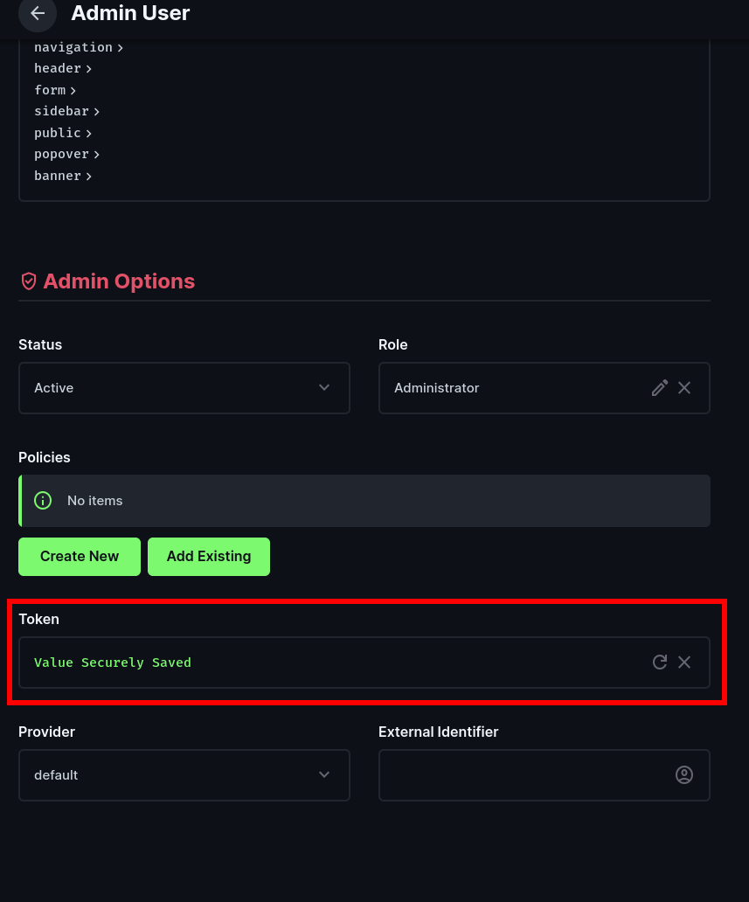

# Nuxt + Directus

This is a Nuxt module to integrate rstore with [Directus](https://directus.io/docs/) directly.

1. Install the `@rstore/nuxt-directus` module:

::: code-group

```sh [npm]
npm install @rstore/nuxt-directus
```

```sh [pnpm]
pnpm add @rstore/nuxt-directus
```

:::

2. Go in your Directus project instance with an admin user and create a new Admin Token.



::: tip Why the Admin Token is needed?
This Admin Token will be used to automatically retrieve the collections in your Directus instance - then the module will generate from this introspection all of the necessary rstore collections for you.
:::

3. Create an `.env` entry with your Directus Admin Token:

```txt
DIRECTUS_TOKEN=<paste-your-token-here>
```

4. Configure Nuxt by adding the module and setting up the directus options in your `nuxt.config.ts` file:

```ts
export default defineNuxtConfig({
  modules: [
    '@rstore/nuxt-directus',
  ],

  runtimeConfig: {
    // Server-only
    directusToken: process.env.DIRECTUS_TOKEN,
  },

  rstoreDirectus: {
    url: 'https://your-directus-instance.com', // The URL of your Directus instance
    adminToken: process.env.DIRECTUS_TOKEN, // or use runtime config indirection
    scopeId: 'rstore-directus', // Optional
  },
})
```

::: warning
Keep the admin token server-side only. Do not expose it in public runtime config.
:::

5. Now you can use the `useStore` composable in your components to access the Directus collections:

```vue
<script lang="ts" setup>
const store = useStore()

const filter = ref<'all' | 'unfinished' | 'finished'>('all')
const { data: todos } = await store.Todos.query(q => q.many({
  filter: filter.value === 'all'
    ? undefined
    : {
        completed: {
          _eq: filter.value === 'finished',
        },
      },
}))
</script>
```

In this example, `Todos` is the Directus collection name exposed on the store API. The query uses standard Directus [filter rules](https://docs.directus.io/reference/filter-rules), which are also computed client-side when rstore can safely evaluate them from the local cache.

## Query Options

You can use Directus [global query parameters](https://docs.directus.io/reference/query) directly in rstore find options:

```ts
const { data: todos } = await store.Todos.query(q => q.many({
  filter: {
    completed: { _eq: false },
  },
  fields: ['id', 'title', 'completed'],
  sort: ['-date_created'],
  limit: 20,
  offset: 0,
}))
```

Supported REST query options are:

- `filter`
- `fields`
- `search`
- `sort`
- `limit`
- `offset`
- `page`
- `deep`
- `alias`
- `backlink`
- `version`
- `versionRaw`

rstore pagination options are also mapped to Directus requests: `pageIndex` and `pageSize` become `offset` and `limit` when explicit Directus pagination is not provided.

## Cache Filtering

The module evaluates supported Directus filters, sorting, and pagination locally when reading from the rstore cache. If a query cannot be evaluated safely, rstore falls through to a Directus fetch instead of returning a possibly incorrect cache result.

Cache-side filtering supports scalar operators such as `_eq`, `_neq`, `_lt`, `_lte`, `_gt`, `_gte`, `_in`, `_nin`, `_null`, `_nnull`, string contains/starts/ends variants, `_between`, `_nbetween`, `_empty`, `_nempty`, `_regex`, `$NOW`, and Directus function parameters such as `year(date_created)`.

These filters are sent to Directus but are not evaluated locally yet:

- Relation filters
- `$CURRENT_USER`, `$CURRENT_ROLE`, `$CURRENT_ROLES`, and `$CURRENT_POLICIES` dynamic variables
- `$FOLLOW`
- Geometry operators

## Generated Schema

At Nuxt build time, the module introspects Directus collections, fields, and relations with the admin token. It generates rstore collections with:

- Primary key-aware `getKey` functions
- Directus singleton metadata
- TypeScript item interfaces from Directus fields
- Safe one-to-many alias-side rstore relations

Directus singleton collections are exposed as rstore collections with one stable local key. Reads use Directus singleton reads and updates use Directus singleton updates.

For relations, the module keeps many-to-one foreign key fields as regular scalar fields. It only generates alias-side relations when Directus exposes a non-colliding alias field, which avoids replacing raw foreign keys with nested objects in the rstore cache.
